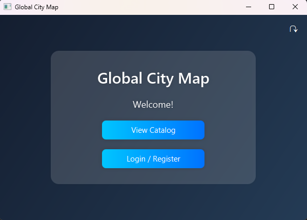
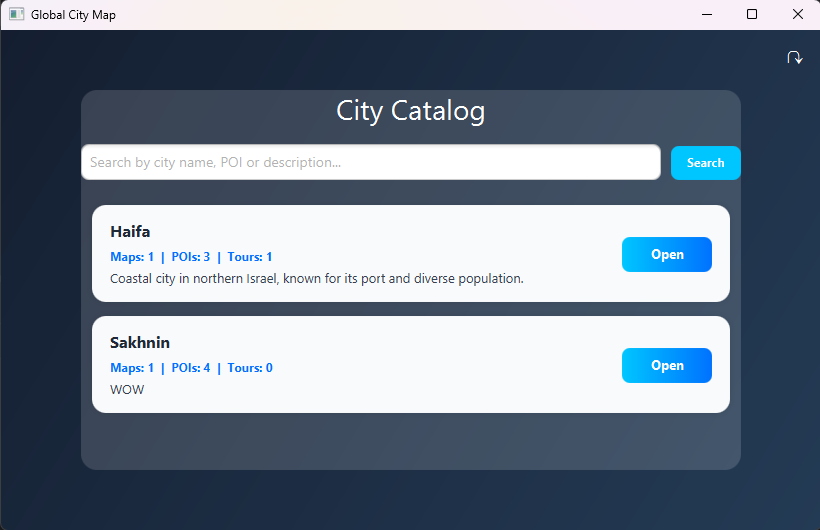
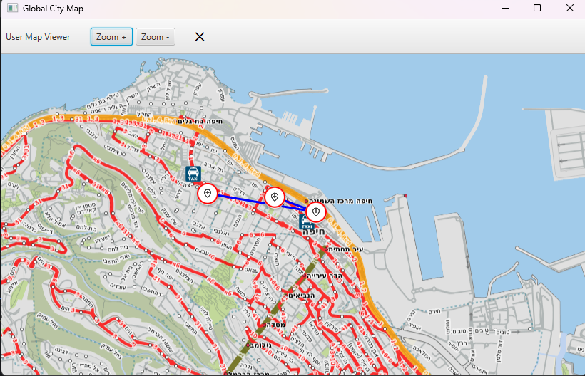
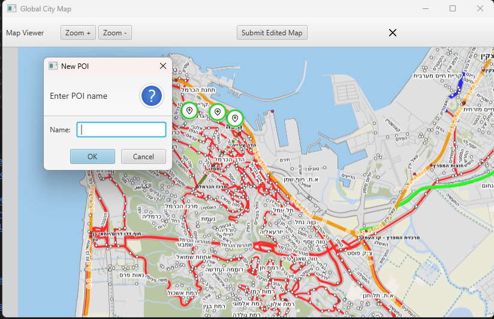
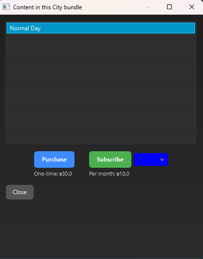
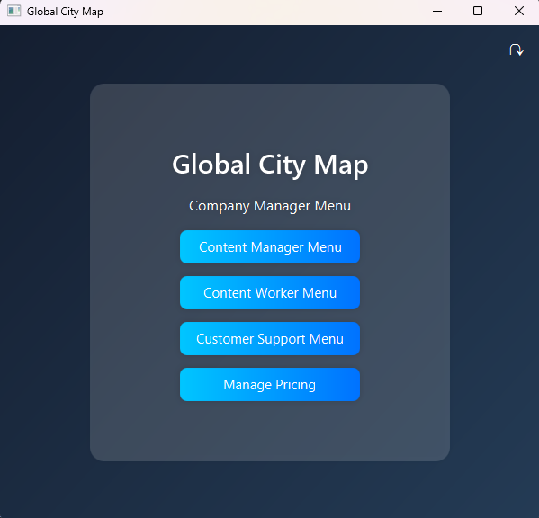
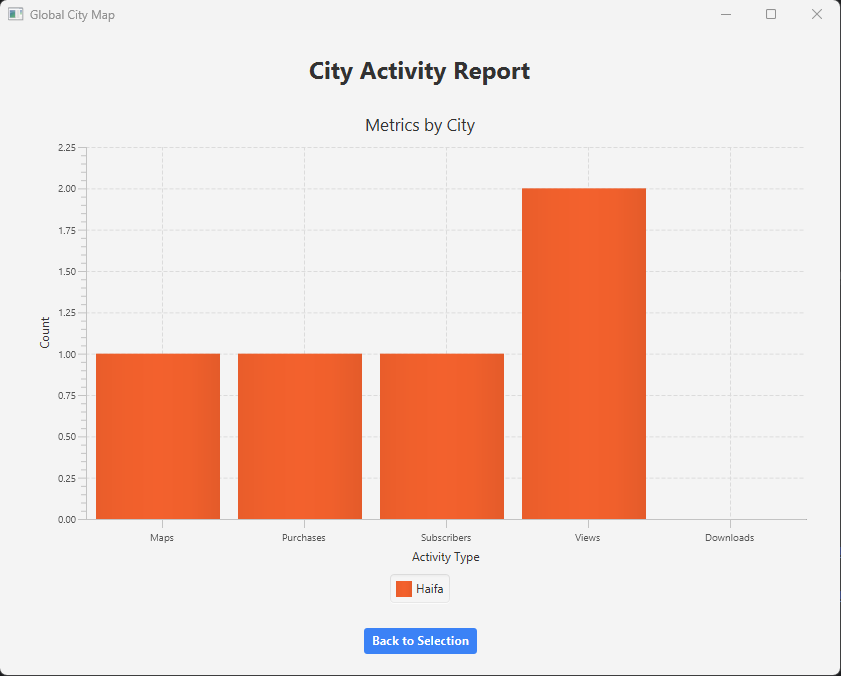

# Global City Map (GCM)

Global City Map is a distributed desktop application for managing, exploring, and purchasing digital city maps.

The system was developed as a **team project for a university Software Engineering course**. It implements a client-server architecture with a MySQL relational database and provides interactive city maps, points of interest, routes, purchases and subscriptions, content-management and approval workflows, customer support, reporting, role-based employee access, and an optional local AI support assistant.

<p align="center">
  
</p>

---

## Overview

GCM simulates a digital city-map service used by both customers and company employees.

Customers can browse a public catalog, explore city maps, view points of interest and routes, purchase or subscribe to city content, access purchased maps, and contact customer support.

Employees use a separate role-based environment for managing the platform. Depending on their permissions, employees can create and modify map content, manage POIs and routes, submit and approve content changes, manage pricing, handle customer requests, and generate activity reports.

The application is implemented in **Java 21 with JavaFX**, follows a multi-module **client-server architecture**, and uses a **MySQL relational database** for persistent storage.

---

## Features

### City Catalog & Interactive Maps

- Browse the public city catalog without authentication
- Search city content
- View information about available cities
- Display interactive city maps
- View points of interest (POIs)
- View predefined city routes/tours
- Navigate maps using zoom controls
- Access purchased city content

### Customer Accounts

- User registration
- Login and logout
- Registration input validation
- Password requirement validation
- Failed-login attempt tracking
- Temporary blocking after repeated failed login attempts
- Purchase history
- User messages
- Customer-support complaints

### Purchases & Subscriptions

Customers can obtain access to city content through:

- One-time purchases
- Recurring subscriptions
- Subscription management
- Previously purchased maps

Payment functionality is simulated as part of the academic project and does not communicate with a real payment provider.

### Content Management

Authorized content employees can maintain the geographic information available through GCM.

Supported workflows include:

- Create cities
- Create and edit maps
- Add and edit POIs
- Create and edit routes
- Delete existing content
- Manage city/content pricing
- Submit modified content for approval
- Review pending content changes
- Approve content changes

### Employee Roles & Access Control

GCM provides different interfaces and capabilities depending on an employee's authorization level.

The system contains several employee roles, including:

- Worker
- Content Worker
- Content Manager
- Customer Support
- Company Manager

Higher-level roles have access to additional functionality and management interfaces while specialized operations remain available to the appropriate employees.

### Management & Reporting

Management functionality includes:

- Pricing management
- Customer management
- City activity reports
- Date-based report generation
- Statistics for:
  - Maps
  - Purchases
  - Subscribers
  - Views
  - Downloads

### AI-Assisted Customer Support

GCM includes an **optional local AI customer-support assistant** powered by **Ollama** using the **Mistral** model.

The assistant acts as the first stage of the customer-support workflow:

1. A customer submits a support question.
2. The local AI assistant attempts to answer the request.
3. If the bot cannot resolve the request, the support ticket can continue through the human customer-support workflow.

The support-ticket model distinguishes between tickets waiting for the bot and tickets waiting for a human, as well as whether a response was provided by the bot or a human support employee.

The AI component runs locally on the **server machine**. Client machines do not need to install or run Ollama.

AI support is optional and can be enabled when starting the server.

---

## Screenshots

### City Catalog

<p align="center">
  
</p>

The public catalog allows users to browse available cities and inspect their available maps, points of interest, and tours.

### Interactive Map Viewer

<p align="center">
  
</p>

City maps contain interactive POI markers and support map navigation and route information.

### Content Editing

<p align="center">
  
</p>

Content workers can interact directly with city maps to create or modify POIs, maps, and routes before submitting changes through the approval workflow.

### Purchasing & Subscriptions

<p align="center">
  
</p>

Customers can purchase city content once or subscribe for continued access.

### Employee Management

<p align="center">
  
</p>

Employee functionality is separated according to role and authorization level.

### Activity Reports

<p align="center">
  
</p>

Managers can generate city activity reports for selected time periods and inspect usage and business metrics.

---

## Architecture

GCM uses a distributed client-server architecture.

```text
┌───────────────────────────────────┐
│           JavaFX Client           │
│                                   │
│   Views • Controllers • Maps      │
└─────────────────┬─────────────────┘
                  │
                  │ Requests / Responses
                  │
                  ▼
┌───────────────────────────────────┐
│             GCM Server            │
│                                   │
│ Request Handling                  │
│ Business / Service Layer          │
│ Repository / Data Access Layer    │
│ Optional AI Support               │
└─────────────────┬─────────────────┘
                  │
                  │ JDBC
                  │
                  ▼
┌───────────────────────────────────┐
│               MySQL               │
│        Relational Database        │
└───────────────────────────────────┘
```

Communication between the client and server is built on top of **OCSF**.

A separate `common` module contains models, DTOs, request/response messages, and payload classes shared by both sides of the application.

### Server Organization

The server separates request handling, application logic, and database access:

```text
Client Request
      │
      ▼
Request Handler
      │
      ▼
Service Layer
      │
      ▼
Repository / Data Layer
      │
      ▼
    MySQL
```

This keeps network communication, business logic, and persistence responsibilities separated.

---

## Software Engineering Documentation

GCM was developed as a complete Software Engineering course project rather than only as an implementation exercise.

The project was designed from an initial system specification and was accompanied by software-engineering documentation produced throughout the development process.

This includes **use cases and system/design diagrams** describing the requirements, actors, workflows, structure, and behavior of the system.

These artifacts document the progression of the project from requirements and analysis through design, implementation, and testing.

The available engineering documentation can be found under:

```text
docs/design/
```

This documentation is kept alongside the implementation to preserve both the final system and the engineering process used to design it.

---

## Project Structure

```text
Global-City-Map/
│
├── client/
│   ├── src/main/java/
│   │   ├── gcm/client/controllers/
│   │   ├── gcm/client/network/
│   │   └── gcm/client/utill/
│   │
│   └── src/main/resources/
│       ├── gcm/client/
│       └── map resources/
│
├── common/
│   └── src/main/java/common/
│       ├── dto/
│       ├── messages/
│       └── model/
│
├── server/
│   ├── src/main/java/gcm/server/
│   │   ├── bot/
│   │   ├── controllers/
│   │   ├── data/
│   │   ├── network/
│   │   ├── service/
│   │   └── ui/
│   │
│   └── src/main/resources/
│
├── tests/
│
├── database/
│   └── init.sql
│
├── docs/
│   ├── screenshots/
│   └── design/
│
└── pom.xml
```

---

## Tech Stack

| Technology | Usage |
|---|---|
| Java 21 | Main application language |
| JavaFX 21.0.4 | Desktop UI and map interfaces |
| MySQL | Relational database |
| JDBC | Database communication |
| Maven | Dependency and project management |
| JUnit 5 | Automated testing |
| TestFX | JavaFX UI testing |
| OCSF | Client-server communication framework |
| Gson | JSON serialization/deserialization |
| Ollama | Optional local AI runtime |
| Mistral | Local model used by the support assistant |

---

# Running the Project

## Prerequisites

The project has been verified with:

- **Microsoft JDK 21.0.9**
- **JavaFX 21.0.4**
- **MySQL Server 8**
- **Maven 3.9+**
- **IntelliJ IDEA**

The most recently verified development environment used IntelliJ's bundled **Maven 3.9.11**.

---

## 1. Clone the Repository

```bash
git clone https://github.com/AdamAS1998/Global-City-Map.git
cd Global-City-Map
```

Open the root project in IntelliJ IDEA and allow Maven to load the modules and dependencies.

---

## 2. Initialize the Database

Make sure your local MySQL server is running.

The repository contains the SQL script required to initialize the GCM database:

```text
database/init.sql
```

The script creates:

```text
GCM_DB
```

and initializes the tables required by the application, including data for:

- Users
- Cities
- POIs
- Maps
- Routes and route stops
- Pending map/route changes
- Pending pricing changes
- Purchases
- Subscriptions
- Messages
- Support tickets
- View logs
- Download logs

It also inserts initial local/demo data used by the project.

### Using MySQL Workbench

Open:

```text
database/init.sql
```

in MySQL Workbench and execute the script.

### Using the MySQL Command Line

Alternatively:

```bash
mysql -u root -p < database/init.sql
```

The default local JDBC URL used by GCM is:

```text
jdbc:mysql://localhost:3306/GCM_DB
```

Database credentials are entered through the server configuration screen and are not stored in the repository.

> The users created by `init.sql` are local/demo accounts intended only for running and demonstrating the academic project.

---

## 3. Configure JavaFX in IntelliJ

When running the application directly through IntelliJ, JavaFX must be available on the module path.

The project uses:

```text
JavaFX 21.0.4
```

Example Windows VM options:

```text
--module-path "C:\Users\<YOUR_USER>\.m2\repository\org\openjfx\javafx-controls\21.0.4;C:\Users\<YOUR_USER>\.m2\repository\org\openjfx\javafx-fxml\21.0.4;C:\Users\<YOUR_USER>\.m2\repository\org\openjfx\javafx-graphics\21.0.4;C:\Users\<YOUR_USER>\.m2\repository\org\openjfx\javafx-base\21.0.4" --add-modules javafx.controls,javafx.fxml
```

If your Maven repository is located elsewhere, replace the paths accordingly.

---

## 4. Start the GCM Server

Run:

```text
gcm.server.ui.ServerMain
```

The server configuration window allows you to provide:

- JDBC URL
- MySQL username
- MySQL password
- Optional AI support

Enter your local database credentials and start the server.

---

## 5. Start the GCM Client

After the server is running, run:

```text
gcm.client.utill.ClientApp
```

The normal startup order is:

```text
MySQL
  ↓
GCM Server
  ↓
GCM Client
```

---

# Optional AI Support

The customer-support bot is **not required** to run the core GCM application.

It runs locally on the server using **Ollama** and the **Mistral** model.

The bot attempts to respond to customer questions before the request is escalated to human customer support when necessary.

## 1. Install Ollama

Install Ollama for your operating system.

After installation, verify it from a terminal:

```bash
ollama --version
```

If a version number is displayed, Ollama is installed correctly.

## 2. Download Mistral

Run:

```bash
ollama pull mistral
```

Wait for the model download to complete.

This only needs to be performed once.

## 3. Enable the Bot

Start:

```text
gcm.server.ui.ServerMain
```

and enable:

```text
AI Support Bot (Ollama)
```

from the server configuration window before starting the server.

The **client does not need Ollama installed**.

### AI Requirements / Limitations

Local LLM inference can consume a significant amount of RAM and may respond slowly on older computers.

The generated answers may also occasionally be inaccurate, as with other LLM-based systems.

If you do not want to use the AI support functionality, simply start the server without enabling it.

---

# Tests

GCM includes automated tests for important registration and purchasing workflows using **JUnit 5** and **TestFX**.

The current automated suite contains **10 tests**.

Coverage includes:

- Successful registration
- Duplicate registration
- Invalid username handling
- Invalid password handling
- Registration UI validation
- Purchase workflows
- Purchase UI behavior

The complete suite has been verified successfully:

```text
10 / 10 tests passed
```

## Test Database Configuration

Some tests communicate with the local GCM database.

Before running the integration tests, locate:

```text
tests/src/main/java/test/UnitTests/Registration.java
```

and replace:

```java
public static final String DB_PASS = "YOUR_MYSQL_PASSWORD";
```

with the password for your local MySQL instance.

> Do not commit your local database password.

### JavaFX Test Configuration

When running the JavaFX tests directly through IntelliJ, the test runtime must use the same JavaFX version as the rest of the project.

The currently verified configuration uses:

```text
Java 21
JavaFX 21.0.4
```

---

# Design & Implementation Highlights

## Shared Client-Server Protocol

The `common` module defines the objects exchanged between the client and server.

It includes:

- Request and response objects
- Request types
- Payload objects
- Shared domain models
- DTOs

This provides a common communication contract without duplicating these structures between the client and server.

---

## Content Approval Workflow

Editing production content is separated from approving it.

Content workers can create or modify map information and submit changes for review. Pending changes can then be processed through the content-management approval workflow.

```text
Create / Edit
      │
      ▼
Pending Change
      │
      ▼
Review
      │
      ├── Approve
      │
      └── Reject / Leave Unapproved
```

This allows map information to be reviewed before becoming approved content.

---

## Interactive Map Content

The map subsystem combines base map imagery with application-level content such as:

- POI markers
- POI selection
- Routes
- Map editing
- Content creation
- Zoom/navigation
- User map viewing

The base map imagery itself is currently packaged as part of the client resources, while the database stores the associated city/content information.

---

## Role-Based Employee Functionality

Employee interfaces expose functionality according to authorization level.

Different employee roles are provided with different menus and available operations, allowing management functionality to remain separated from normal worker and customer functionality.

---

## Local AI Integration

The AI assistant runs independently of the client application.

```text
Customer Question
       │
       ▼
   GCM Server
       │
       ▼
 AI Support Bot
       │
       ▼
 Ollama / Mistral
       │
       ├── Response generated
       │
       └── Cannot resolve
                │
                ▼
         Human Support
```

Keeping the AI runtime on the server means client machines do not need the model or Ollama installed.

---

# My Contributions

GCM was developed collaboratively by a team as part of a university Software Engineering course.

My primary responsibilities focused on **database design, authentication and authorization, employee access control, and content-management functionality**.

My contributions included:

### Database

- Designed the relational database structure used by the system.
- Worked with the server-side persistence layer and application data.

### Authentication & Registration

- Implemented user registration functionality.
- Implemented login/authentication functionality.
- Implemented password requirement validation.
- Added contextual guidance for registration requirements.
- Implemented failed-login attempt tracking.
- Implemented temporary user blocking after repeated failed authentication attempts.

### Employee Authorization

- Implemented the employee authorization hierarchy.
- Built employee-facing menus and navigation.
- Controlled functionality according to employee role.
- Implemented progressively broader access for worker, content worker, content manager, and management functionality.

### Map System

- Contributed to the interactive map viewer together with another team member.
- Worked on the map interaction and content-management functionality built around the viewer.

### Content Management

Implemented much of the content creation/editing workflow, including:

- Creating maps
- Editing maps
- Adding POIs
- Editing POIs
- Creating routes
- Editing routes
- Deleting content
- Creating city content
- Pricing management

### Approval Workflow

- Implemented the pending-content workflow.
- Implemented submission of edited content for approval.
- Implemented approval handling for content modifications.

---

# Known Limitations

GCM was developed as an academic software-engineering project rather than as a production deployment.

Areas that would require additional work for production use include:

- **Password storage:** passwords should be stored using a modern salted password-hashing algorithm rather than direct password comparison.
- **Payment processing:** payment functionality is simulated and is not connected to a real payment provider.
- **Base map storage:** base map assets are currently stored as application resources and shipped with the client rather than being stored and distributed through the database/server. As a result, adding a completely new city requires its base map resources to already exist on the client. A future version could store or upload map assets through the server so that new cities and their maps can be added dynamically.
- **Database deployment:** the current database configuration is primarily designed for a local development environment.
- **Desktop client:** the current client is implemented using JavaFX.
- **Development setup:** some startup configuration is currently IntelliJ/development-environment oriented.
- **AI reliability:** AI-generated responses may occasionally be inaccurate.
- **AI resource requirements:** local AI inference may require significant RAM and processing time.

---

# Academic Project

Global City Map was developed as a **team project for a university Software Engineering course**.

The project was based on a provided system specification requiring the team to design and implement a distributed Java information system supporting client-server communication, a relational database, multiple simultaneous users, different user and employee roles, map/content management, and customer-facing functionality.

The project included both the implementation itself and supporting software-engineering artifacts such as **use cases and system/design diagrams**, documenting the analysis and design process that led to the final application.

The repository preserves the project's collaborative development history.

The project is presented here as part of my software-engineering portfolio and as a record of my individual contributions to the team's implementation.

---

## Repository Status

The project has been recovered from its original university development environment, cleaned for public presentation, and tested again with a modern Java 21 / JavaFX 21 environment.

Current verification:

- Application starts successfully
- Server connects to MySQL
- Client connects to server
- Core workflows manually smoke-tested
- Automated tests: **10 / 10 passing**
- Development artifacts and IDE-specific files removed from the tracked repository
- Local database credentials excluded from source control

---

## Author / Contributor

**Adam Abu Saleh**

Computer Science student  
Software Engineering project contributor